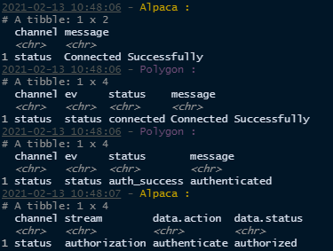

```{r setup, include = FALSE}
knitr::opts_chunk$set(
  collapse = TRUE,
  comment = "#>",
  eval = TRUE
)

devtools::load_all()
```

The handling of Websockets in `{AlpacaforR}`is accomplished with the help of `{R6}` by Winston Chang and `{websocket}` by Joe Cheng. 

## Creating a websocket connection

`{AlpacaforR}` handles connecting and authentication with both the Alpaca & Polygon websockets internally provided the AlpacaforR environmental variables are already set-up (see `vignette("installation", package = "AlpacaforR")` if you're unsure what this means.) To create and authenticate both websockets, simply call the `new()` method as is. If you are not using a live account and thereby do not have access to Polygon, specify `"a"` or `"Alpaca"` as the first argument when calling the `new()` method on the `AlpacaStreams` object.

The following code assumes that both paper & live accounts are set up and the latter is able to connect to Polygon.

There are a number of options that can be supplied when creating a websocket:

\describe{
\item{\code{socket}}{\code{(character)} Which Websocket stream to connect to - either \code{"alpaca"} or \code{"polygon"} (or an abbreviation thereof). \strong{Default} connects to both.}

\item{\code{toConsole}}{\code{(logical)} flag for whether to report websocket messages to the console. \strong{Default} \code{TRUE}.}

\item{\code{log}}{\code{(logical)} flag for whether to retain a log of messages (from Alpaca) or messages & bars from symbol feeds from Polygon. \strong{Default} \code{TRUE} to store logs.}

\item{\code{log_limit}}{\code{(numeric)} indicating the number of previous messages to retain in the log. \strong{Default} \code{5000}. See Details for memory handling specifics.}

\item{\code{bars_limit}}{\code{(numeric)} indicating the number of previous bars (per subscription feed) to retain in the log. \strong{Default} \code{5000}. See Details for memory handling specifics.}

\item{\code{write_dir}}{\code{(character/logical)} The directory in which to store logs on disk. Use \code{FALSE} to disable logging to disk. Folders will be created. \strong{Default} \code{"AlpacaStreams"}.}

\item{\code{overwrite}}{\code{(logical)} indicating whether to overwrite data from previous instances of a websocket connection. \strong{Default} \code{TRUE}.}

\item{\code{msg_action}}{\code{(expression)} An expression that performs a user-specified action on the receipt of websocket message. These can act on the \code{msg} tibble object seen printed to the console when a message is received (it \code{toConsole = TRUE}. The \code{msg} object also contains a \verb{$ts} column with the timestamp as a \code{POSIXct} and a \verb{$socket} column with the socket name of origin (\code{"Alpaca"/"Polygon"}) that are not visible in what is printed to the console but accessible to \code{msg_action}. The expression can also reference the \code{self} internal environment of this \verb{\link[R6]\{R6class\}}.}


\item{\code{live}}{See \link{market_data}}

\item{\code{...}}{Passed on to \link[websocket]{Websocket}}
}
```{r 'Instantiate Websocket'}
AS <- AlpacaStreams$new()
```
```{r 'sleep to instantiate', include=FALSE}
Sys.sleep(10)
```

If properly configured, the console will indicate that both sockets (or the specified socket) have/has been connected and authorized:

If errors occur, ensure that `{AlpacaforR}` is set-up correctly. See `vignette("installation", package = "AlpacaforR") for details.

When a socket is instantiated with `write_dir = 'AlpacaStreams'` (the default), a folder is created called AlpacaStreams with sub-directories labelled according to each socket that was connected to which contain log files for each channel connected to via the socket. 

```{r 'Log files present'}
dir.exists("AlpacaStreams")
dir.exists(file.path("AlpacaStreams", "Alpaca"))
dir.exists(file.path("AlpacaStreams", "Polygon"))
file.exists(file.path("AlpacaStreams", "Alpaca", "status.log"))
file.exists(file.path("AlpacaStreams", "Polygon", "status.log"))
```

The location of the write directory can be changed by specifying the preferred directory or the disk writing behavior can be turned off by setting `write_dir = FALSE`.

## Connecting to channels
If the websocket(s) have/has connected and authorized properly, channels can be subscribed to with the `$channel` method. See the documentation for `?AlpacaStreams` for usage of this method. The arguments to `channel` are as follows:

\describe{
\item{\code{channel}}{The channel to join}

\item{\code{subscribe}}{\code{(logical)} \strong{Default \code{TRUE}}. Set to \code{FALSE} to unsubscribe from specified channel(s).}

\item{\code{overwrite}}{\code{(logical)} \strong{Default} \code{FALSE}. Set to \code{TRUE} to overwrite data from previous instances of this channel socket.}

\item{\code{...}}{Named parameters of \href{../../AlpacaforR/html/AlpacaStreams.html}{\code{AlpacaStreams$new()}} to be applied to this particular channel.}
}

To quickly subscribe to both the Alpaca account `channel = 'a'` & trade `channel = 't'` channels, simply call `channel` with no arguments:

```{r 'subscribe to alpaca channels'} 
AS$channel()
```

Polygon channels are formatted as follows:

\itemize{
\item{T.* Trades}
\item{Q.* Quotes}
\item{A.* Aggregate ( per second )}
\item{AM.* Aggregate ( per minute )}
}

Where * is the ticker symbol. To subscribe to Gamestop (GME) data by the second, use the following call:
```{r 'gme subscribe'}
AS$channel("a.gme")
```

The console starts filling up fast when subscribed to a stream sending messages on a second interval. The console output can be turned off by editing the options for the channel. Options for this channel can be found in the Polygon websocket. General options for all channels are listed in the `opts` field while options for individual channels can be found as list objects within. By setting the `toConsole` argument to `FALSE` for this channel the console output is effectively muted, while the logging & writing to disk continues silently.


```{r 'turn off console output'}
AS$Polygon$opts$A.GME$toConsole <- FALSE
```

To unsubscribe from the by-second stream, call `$channel` with `subscribe = FALSE`
```{r 'unsubscribe a.gme'}
AS$channel("a.gme", FALSE)
```


## Logging

If wondering what the last message was for a particular socket, use `$lastmessage`

```{r 'last message'}
AS$Polygon$lastmessage()
```

Though no longer subscribed to the by-second stream, the logs are still available by calling the `$logs` method for the given channel.

```{r 'get the logs'}
AS$logs("a.gme")
```

#### _A Note on RAM_ 
In RAM logging of messages is capped at the number specified by `log_limit` & `bars_limit` where the former corresponds to all messages and the latter corresponds to messages from Polygon ticker streaming data specifically. The limit is applied to each instance IE `log_limit = 5000` will limit message logs for Polygon and Alpaca to 5000 message each, after which old message will be deleted.
`bars_limit` applies to each channel log. Using the example above, if both channels were subscribed to indefinitely, each would be limited to a 5000 row log. 
If many channels are subscribed to and RAM usage reaches 95% capacity a warning will be given. At 98% capacity the websocket will be stopped to prevent an overflow.

## Provide a custom action

The `msg_action` argument allows for a custom expression to run each time a message is received. This expression can call all public (the `self` object) and private (the `private` object) fields/functions within the AlpacaSocket. See ?AlpacaSocket for details as to what these are or this [primer on R6 in Advanced R](https://adv-r.hadley.nz/r6.html#r6) if you're unsure about what this means. 
For example, perhaps we would like a Pushbullet notification via [RPushbullet](https://github.com/eddelbuettel/rpushbullet) when the value of a ticker moves more than `X`% from the time the socket is instantiated. 

First, an object to store the relevant data is created:
```{r 'create tracker'}
notification_tracker <- list(
  initial_price = NULL,
  current_price = NULL,
  difference = NULL,
  threshold = .05 # setting X to 5%
)
```

Secondly, an expression is created to capture and store the relevant data to the object and send the notification when the conditions are met.
```{r 'expression'}
msg_action <- rlang::expr({
  # if it's a message with ticker aggregate data
  if (grepl("(?:^AM)|(?:^A)", msg$channel)) {
    # check to see if the initial price has been set, if not, set it
    if (is.null(notification_tracker$initial_price)) {
      notification_tracker$current_price <- notification_tracker$initial_price <- msg$h
    } else {
      # otherwise set the low as the current price
      notification_tracker$current_price <- msg$l
      # compute the change 
      notification_tracker$difference <- 1 - (notification_tracker$current_price / notification_tracker$initial_price)
      # if the change is greater than the threshold
      if (abs(notification_tracker$difference) > notification_tracker$threshold) {
        #send the notification
        RPushbullet::pbPost("note", title = "Message from AlpacaStreams", body = paste0(msg$sym, " has moved by ", notification_tracker$difference * 100,  "%"))
      }
    }
  }
})
```

Let's set the notification tracker on the by minute stream for Gamestop
```{r 'am.gme'}
AS$channel("am.gme", msg_action = msg_action)
```

```{r include = FALSE}
Sys.sleep(61)
```

To ensure it's working, we can take a look at the notification tracker object.

```{r show_nt}
notification_tracker
```

When ready to close the sockets, call `$close` from the AlpacaStreams object to close both sockets. 
```{r 'close_both'}
AS$close()
```
Or close individual sockets
```{r 'close_poly'}
AS$Polygon$close()
```

The logs for the sockets are still available on-disk:
```{r 'read_logs'}
readr::read_csv("AlpacaStreams/Polygon/AM.GME.csv")
```

If you have ideas for how the interface might be improved or you encounter a bug, please open an issue on Github
